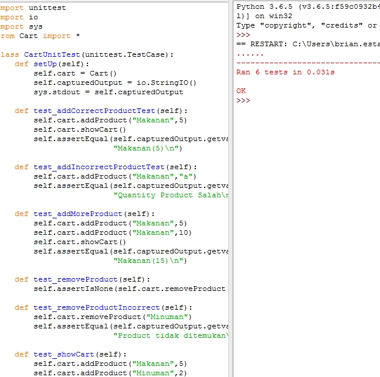
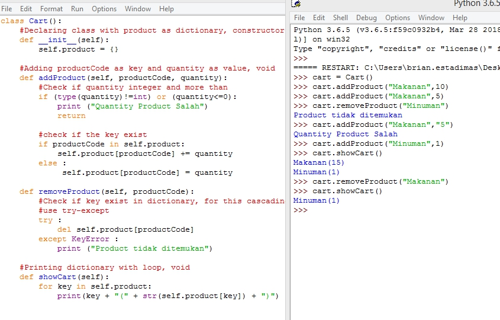

## Getting Started

This is a simple program (unittest and implementation) with functions :

1. `void addProduct(string productCode, int quantity)`
    - Add a product with the specified quantity.
    - If the product is already in the cart, accumulate the quantity.
2. `void removeProduct(string productCode)`
    - Remove the product from within the cart.
3. `void showCart()`
    - Print the content of cart with the following format: `{productCode}`(`{quantity}`)

Before starting, you will need:

- Python 3.5 above
you can download here : https://www.python.org/downloads/
set pip and PATH to environment variables when installation

## How to run and test the program :

- Use python IDLE, and press F5 for run module, or

- Use CMD, go to directory file you have cloned or downloaded, then open cmd in same directory

For example using `Windows + R` : "C:\Users\brian.estadimas\Downloads\Cart\" then type `python Cart.py`

- Use same method to open `test_cart.py`

## You can open source code with notepad++ or sublime

Testing function :

